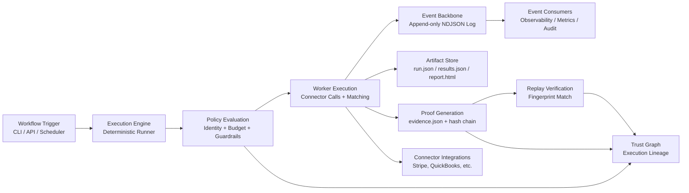

# Settler Architecture Overview

Settler is an open-source reconciliation system with deterministic execution, policy enforcement, and replayable proof artifacts.

## Runtime architecture diagram

## System shape

- **Web surface (`packages/web`)**: dashboard, docs, and demo UX.
- **API surface (`packages/api` + `packages/web/src/app/api`)**: run creation, listing, metrics, and evidence access.
- **Engine + runner (`runner`, `scripts/moat`)**: deterministic execution and replay verification.
- **Platform layer (`platform/`)**: trust graph, policy simulator, AI copilot, chaos harness, and event consumers.
- **Connector ecosystem (`packages/adapters`)**: adapter drivers with normalization and safety controls.
- **CLI (`packages/cli`)**: replay, verification, and foundry tooling.
- **Storage (Postgres/Supabase via Prisma)**: tenant-scoped run state and metadata.

## Runtime flow

1. Operator or integration starts a workflow run.
2. Policy is evaluated before deterministic execution proceeds.
3. Worker execution reads normalized connector data and applies matching rules.
4. Artifacts + proof are persisted (`run.json`, `results.json`, `evidence.json`, HTML report).
5. Event backbone fans out updates to observability, trust, and audit consumers.
6. Replay verifies the run fingerprint against stored evidence.

## Determinism contract

1. AI cannot modify deterministic execution path directly.
2. Connector outputs are normalized; unstable IDs are canonicalized.
3. Workflow state transitions are deterministic.
4. Replay must produce identical fingerprints.
5. Non-deterministic operations are blocked inside execution fences.

## Deep dive

For internals (execution engine, lineage, proof model, and policy path), see [`docs/ENGINE.md`](docs/ENGINE.md).
