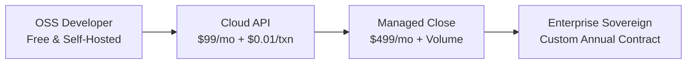

# Settler — Go-To-Market & Commercial Strategy

## 1. Executive Summary

Settler is the deterministic reconciliation intelligence and audit operating system for high-scale financial technology, e-commerce, and enterprise finance organizations. Our GTM motion combines an **Open-Core Product-Led Growth (PLG)** self-serve developer funnel with an **Enterprise Sales Motion** capturing high-ACV multi-year contracts for regulated Fortune 500 organizations.

---

## 2. Target Market & Ideal Customer Profile (ICP)

### Primary ICPs

| Segment | Target Profile | Key Decision Maker | Core Pain Point | Settler Value Proposition |
| :--- | :--- | :--- | :--- | :--- |
| **High-Growth FinTech & Scaleups** | Series A–D, $5M–$100M ARR, processing 50K–5M transactions/mo across multiple PSPs | VP of Eng / Lead Architect / Head of FinOps | Engineers wasting 20+ hrs/wk writing & maintaining brittle recon scripts | API-first deterministic matching engine, 25+ turnkey adapters, instant verification |
| **Mid-Market Multi-Channel Commerce** | $20M–$500M GMV across Shopify, Amazon, TikTok Shop, Stripe, PayPal | Controller / Director of Accounting | High refund/chargeback rate, delayed monthly close (15+ days), ledger discrepancies | Real-time multi-source ingestion, automated fee & tax reconciliation, instant variance triage |
| **Enterprise & Regulated Financials** | Public & Fortune 500, Banks, InsurTech, Payment Facilitators | CFO / Head of Internal Audit / CISO | Strict SOX 404 compliance, multi-million dollar audit prep costs, data sovereignty | Immutable hash-linked proofpacks, 5-layer tenant isolation, maker-checker workflows, DLP |

---

## 3. Commercial Offers & Pricing Model

Settler monetizes across 4 structured commercial tiers aligning customer volume and governance maturity with platform value:



### Plan Breakdown

| Tier | Pricing | Included Volume & Capabilities | Governance & Compliance | Deployment |
| :--- | :--- | :--- | :--- | :--- |
| **OSS Community** | Free / Open Source | Unlimited local execution, Rust kernel matching, CLI tools, basic proofpack output | Community governance, local storage | Self-hosted Docker / Kubernetes |
| **Cloud API** | $99/month + $0.01/txn over 10K | 25+ verified connector drivers, webhook ingestion, live activity feed, exception workbench | Tenant-isolated cloud database, standard DLP redaction | Managed Multi-Tenant US/EU Cloud |
| **Managed Close** | $499/month + volume discounts | Up to 500K txn/mo, continuous close automation, automated variance adjudication, Slack/PagerDuty alerts | SOX dual-approval flows, custom tolerance rules, 99.9% uptime SLA | Managed Dedicated VPC or Isolated Pod |
| **Enterprise Sovereign** | Custom Annual ($25K–$250K+ ACV) | Multi-million txn/sec via TigerBeetle, custom ERP connectors (SAP/NetSuite), dedicated account team | Full SOX 404 audit packs, OpenFGA ABAC, SAML SSO/SCIM, Data residency geo-fencing | Single-tenant Dedicated / On-Prem / VPC |

### High-Margin Add-On Packs
- **High-Frequency Real-time Stream Recon** (Kafka/Kinesis streaming matching)
- **AI Exception Intelligence Copilot** (Self-learning adjudication memory)
- **Multi-Jurisdiction Tax & FX Pack** (Avalara/TaxJar real-time conversion parity)
- **Dedicated Auditor Portal** (One-click auditor logins with cryptographic verification tools)

---

## 4. Competitive Landscape & Defensibility

| Capability | **Settler** | BlackLine | Trintech Cadency | ReconArt | Custom In-House Scripts |
| :--- | :---: | :---: | :---: | :---: | :---: |
| **Execution Engine** | **Deterministic Rust Kernel** | Legacy Java/C# | Monolithic Legacy | Proprietary SaaS | Python/SQL scripts |
| **Evidence Output** | **Hash-linked Cryptographic Proofpack** | PDF reports & Excel dumps | Static reports | Spreadsheet exports | Ad-hoc log files |
| **Speed & Scalability** | **Sub-millisecond / TigerBeetle ready** | Batch scheduled | Batch scheduled | Slow batch | O(n²) script bottlenecks |
| **API & SDK Ecosystem** | **Full REST/CLI/SDK (TS, Python, Go, Java)** | Legacy SOAP/REST | Closed / Limited | Limited REST | None / Custom |
| **Turnkey Connectors** | **25+ verified modern connectors** | Complex legacy ETL | Heavy consultancy setup | Custom dev required | Manually built & maintained |
| **Audit Verification** | **Offline zero-knowledge verifiable** | Auditor access to UI | Auditor access to UI | Auditor access to UI | Manual sampling |
| **Time to First Match** | **< 10 minutes** | 3–6 months onboarding | 6–12 months onboarding | 2–4 months onboarding | Weeks of dev time |
| **Gross Margin Profile** | **85%+ software margin** | Heavy professional services | Heavy consulting fees | Consulting-driven | Constant engineering drain |

---

## 5. Distribution Channels & Go-To-Market Motion

### Phase 1: Developer-First Product-Led Acquisition (Bottom-Up)
- **Zero-Friction Dev Onboarding:** Self-serve repository clone to first matched proofpack in under 5 minutes (`pnpm run bootstrap && pnpm dev`).
- **Developer Hub & SDKs:** Native SDKs in TypeScript, Python, Go, Java, C#, Ruby powering developer workflows.
- **Content & Technical Authority:** Deep architectural teardowns on determinism, TigerBeetle double-entry accounting, and hash-chain verification published across Hacker News, Substack, and GitHub trending.

### Phase 2: Marketplace & Ecosystem Expansion (Middle-Out)
- **App Marketplace Listings:** Certified app listings on Shopify App Store, Stripe Apps Marketplace, QuickBooks App Store, and Xero App Store.
- **Ecosystem Flywheel:** Joint solution briefs with fintech infrastructure providers (Plaid, TrueLayer, Modern Treasury, Lithic).

### Phase 3: Enterprise & Regulatory Outbound (Top-Down)
- **Target Accounts:** Direct ABM targeting VP Finance, Controllers, and Head of FinTech Operations at high-growth Series B–IPO tech companies.
- **Procurement Acceleration:** Pre-packaged Enterprise Trust Packet including:
  - Architecture Decision Records (ADRs)
  - 5-Layer Multi-Tenant Security Invariant Specification
  - DLP & Data Sovereignty Certification
  - Penetration Test Summary & SOC 2 Roadmap

---

## 6. Key Performance Indicators (KPIs) & Milestones

```
[Month 1-3: Seed & Developer Traction]
├── 500+ GitHub Stars & 150+ active OSS instances
├── 25 Paying Cloud API Tier customers ($2.5K MRR)
└── 3 Enterprise Design Partners in pilot testing

[Month 4-6: Acceleration & Monetization]
├── $25K MRR ($300K ARR run-rate) with < 2% net churn
├── 25+ verified adapters in production ecosystem
└── 1st Fortune 500 Enterprise contract closed

[Month 7-12: Scale & Market Leadership]
├── $100K+ MRR ($1.2M ARR)
├── SOC 2 Type II Certified
└── Established category leader in Deterministic Financial Intelligence
```
