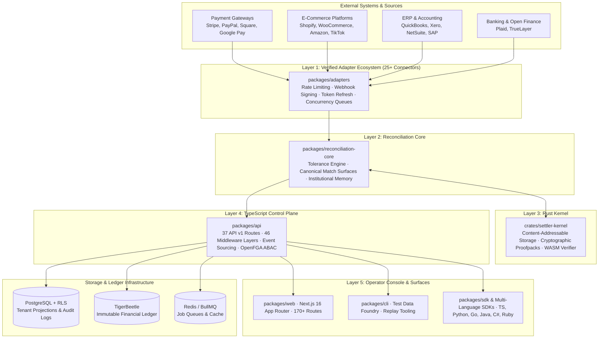

# Settler — Platform Architecture & Technical Overview

Settler is a reconciliation intelligence and audit operating system. It matches financial transactions across data sources with deterministic, replayable outcomes, adjudication-backed institutional memory, and auditor-verifiable evidence bundles.

This document describes the real, shipped architecture. Every capability listed here is backed by verifiable code in this monorepo.

---

## 1. Core Architecture Layers

---

## 2. Layer Deep-Dives

### 2.1 Rust Kernel (`crates/`)

Delivers the deterministic primitives that underpin all reconciliation guarantees:

- **Content-Addressable Storage (CAS):** Every artifact — run outputs, evidence manifests, proofpack entries — is hashed and stored by content digest.
- **Cryptographic Proofpack Generation:** Produces hash-linked, replayable evidence bundles that can be verified offline without network connectivity.
- **WebAssembly Engine (`crates/settler-verify-wasm`):** Enables client-side offline verification of proofpacks inside browser environments.

### 2.2 Reconciliation Core (`packages/reconciliation-core`)

The deterministic matching engine:

- **Configurable Match Policies:** Flexible tolerance rules (absolute/percentage amount tolerances, date/time sliding windows, string normalization).
- **Canonical Run Surface:** Each run is assigned an immutable, content-addressed run ID with complete input attribution.
- **Institutional Memory:** Preserves past operator exception adjudications to train heuristic resolution paths over time.
- **Explicit Degraded-State Semantics:** Never presents a partial result as a successful run; failures are explicitly typed and surfaced.

### 2.3 Verified Adapter Ecosystem (`packages/adapters`)

25+ turnkey connector drivers normalized to unified canonical transaction types:

- **Payments:** Stripe, PayPal, Square, Stripe Connect, Google Pay
- **Accounting:** QuickBooks, Xero, FreshBooks, Wave, NetSuite
- **E-Commerce:** Shopify, WooCommerce, Etsy, Amazon Seller, eBay, Wix Stores, TikTok Shop
- **Banking:** Plaid, TrueLayer
- **Enterprise ERP & Billing:** SAP, NetSuite, Chargebee, Recurly
- **Tax:** TaxJar, Avalara

### 2.4 Control Plane (`packages/api`)

The API server (Express 5, TypeScript):

- **37 Route Modules:** Ingestion, reconciliation runs, SLA monitoring, SOX approvals, DLP, SAML SSO, billing, and workforce orchestration.
- **46 Middleware Layers:** Auth, DLP redaction, rate limiting, request signing, idempotency, ETag caching, and SOC2 logging.
- **OpenFGA Authorization:** Attribute-based access control with fail-closed posture when unavailable.

### 2.5 Operator Console (`packages/web`)

Next.js 16 App Router application with 170+ static and dynamic routes:

- Real-time exception triage workbench with deterministic context.
- Historical run replay lab and cryptographic evidence download.
- Full compliance and security administration (SAML SSO, Data Residency geo-fencing, Maker-Checker queues).

---

## 3. Persistence & Data Model

| Store | Role |
| :--- | :--- |
| **TigerBeetle** | Immutable double-entry ledger for financial-grade transaction accounts and state transitions |
| **PostgreSQL (Supabase)** | Relational operational metadata, tenant configuration, projections, and append-only audit trail |
| **Redis (BullMQ)** | Distributed job queue, concurrency semaphores, rate limiting, and cache |

---

## 4. Multi-Tenant Security Model (5-Layer Invariant)

1. **Middleware Layer:** `tenantMiddleware` resolves `req.tenantId` from JWT/API key before route handlers execute.
2. **Repository Layer:** Every database query requires an explicit `tenantId` parameter enforced by TypeScript types.
3. **SQL Query Layer:** Queries enforce parameterized `WHERE tenant_id = $1` filters.
4. **PostgreSQL RLS Layer:** Database-level Row-Level Security filters by `current_setting('app.current_tenant_id')`.
5. **Entity Layer:** Cross-tenant write operations throw `Error('Tenant mismatch')` before execution.
