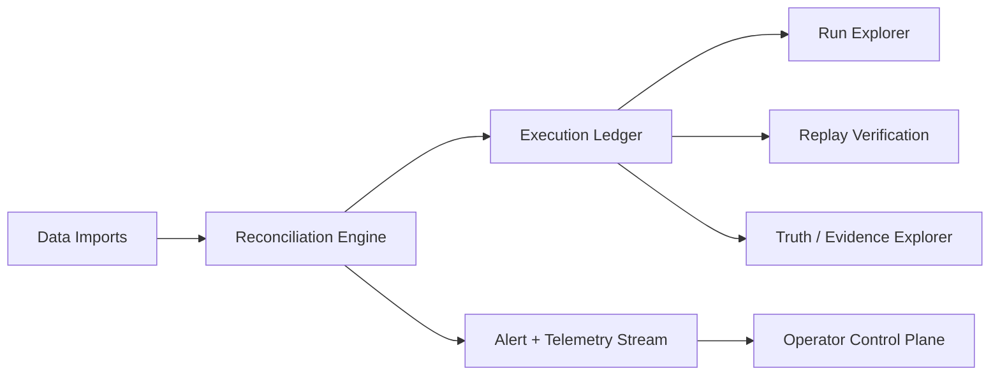

# Settler

Settler is a deterministic reconciliation and operations platform for teams that need reproducible runs, replayable outcomes, and operator-visible evidence.

## Project overview

The repository contains:
- an API/control plane (`packages/api`),
- a web operator console (`packages/web`), and
- a CLI/foundry runtime (`packages/cli`) for deterministic scenario generation, replay, and verification.

Settler focuses on proving behavior under replay rather than only showing a success/failure status.

## Key capabilities

- Deterministic reconciliation execution with replay verification.
- Run Explorer for inspecting run metadata and outcomes.
- Truth Explorer / evidence surfaces for run provenance.
- Policy simulation for scenario-based operational decisions.
- Operator telemetry and health surfaces for alerts and triage.
- Synthetic reconciliation foundry for seeded test-data and regressions.

See `docs/DIFFERENTIATORS.md` for capability-to-code mapping.

## Quick start

```bash
pnpm install
pnpm demo:settler
pnpm dev:stack
```

If you are setting up from a fresh environment, use the expanded flow in `docs/QUICK_START.md`.

## Demo walkthrough

Run the reproducible operator demo:

```bash
pnpm demo:settler
```

The demo performs:
1. sample dataset load,
2. reconciliation execution,
3. runtime event + alert generation,
4. run inspection data output,
5. deterministic replay,
6. policy simulation output.

After completion, the command prints guided next actions:
- Open Run Explorer
- Inspect reconciliation results
- Replay run
- Trigger policy simulation

## Architecture summary



Additional architecture artifacts are in `docs/architecture/` and `ARCHITECTURE.md`.

## Screenshots and demo artifacts

Generate operator screenshots:

```bash
pnpm demo:assets
```

Generated files are saved to `docs/assets`:
- `operator-dashboard.png`
- `run-explorer.png`
- `truth-explorer.png`
- `replay-verification.png`
- `system-health-metrics.png`

## Benchmark evidence

```bash
pnpm benchmark
```

This writes `docs/BENCHMARKS.md` with throughput, run duration, API latency proxy, and memory usage.

## Contributing

See `CONTRIBUTING.md` for contribution workflow, testing expectations, and module conventions.
