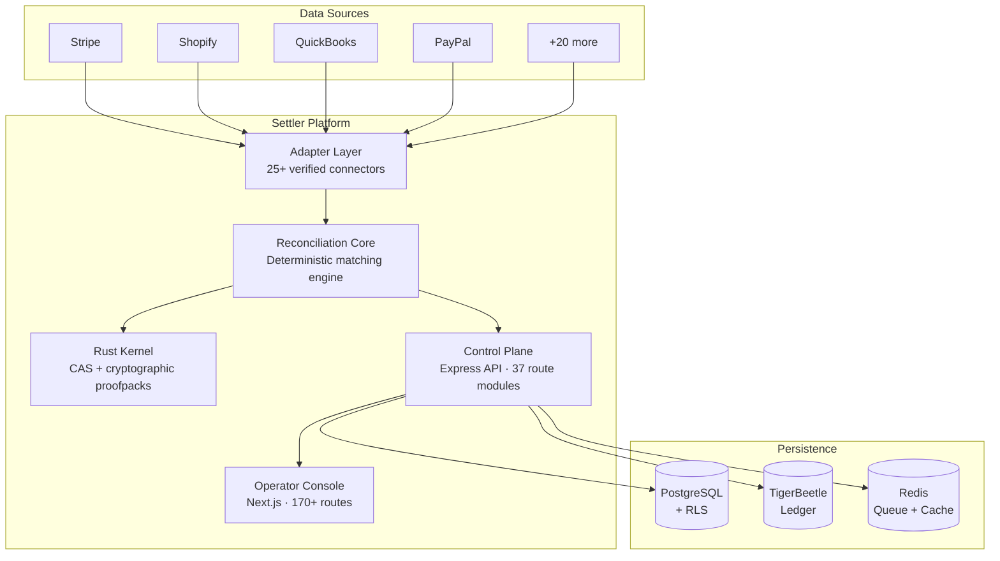

# Settler


**Reconciliation intelligence & audit operating system**  
Deterministic transaction matching · Hash-linked evidence · Enterprise-grade tenant isolation

[](https://github.com/Hardonian/Settler/actions/workflows/ci.yml)
[](LICENSE)


<!-- BEGIN: REPO HERO -->

<!-- END: REPO HERO -->

---

## What Settler Does

Settler replaces spreadsheet reconciliation and custom scripts with a deterministic, API-first matching engine. It ingests financial records from multiple sources, matches them using configurable tolerance rules, flags exceptions into structured adjudication workflows, and exports hash-linked evidence bundles — all tenant-isolated and replayable from scratch.

**Every reconciliation run produces byte-for-byte reproducible results.** No probabilistic guessing. No silent degradation. Auditors get verifiable proofpacks, not screenshots.

## Architecture



## Adapter Ecosystem — 25+ Verified Connectors

| Category | Adapters |
| --- | --- |
| **Payment Processors** | Stripe, PayPal, Square, Stripe Connect, Google Pay |
| **Accounting** | QuickBooks, Xero, FreshBooks, Wave, NetSuite |
| **E-Commerce** | Shopify, WooCommerce, Etsy, Amazon Seller, eBay, Wix Stores, TikTok Shop |
| **Banking & Open Finance** | Plaid, TrueLayer |
| **Enterprise ERP** | SAP, NetSuite (advanced) |
| **Subscription Billing** | Chargebee, Recurly |
| **Tax & Compliance** | TaxJar, Avalara |
| **Analytics** | GA4 Deep Sync |
| **Messaging** | WhatsApp, Telegram (notification adapters) |
| **Social Commerce** | Meta Commerce |

Every adapter includes rate limiting, token refresh, webhook verification, and retry queue integration.

## Tech Stack

| Layer | Technology | Purpose |
| --- | --- | --- |
| **Rust Kernel** | Cargo workspace | Content-addressable storage, cryptographic proofpacks, deterministic primitives |
| **Reconciliation Core** | TypeScript | Matching engine, tolerance evaluation, evidence emission, exception intelligence |
| **Control Plane** | Express 5 + PostgreSQL + Prisma | 37 API route modules, multi-tenant middleware, event sourcing, billing enforcement |
| **Operator Console** | Next.js 16 (App Router) | 170+ routes — run history, exception review, evidence export, admin surfaces |
| **CLI** | TypeScript via tsx | Foundry (test data), replay, prove, first-run validation |
| **Queue** | BullMQ / Redis | Job orchestration with retry, SLA alerting, exponential backoff |
| **Ledger** | TigerBeetle | Immutable double-entry financial records (optional) |

## Enterprise Features

- **Multi-Tenant Isolation** — 5-layer enforcement: middleware → TypeScript interfaces → SQL guards → PostgreSQL RLS → entity-level checks
- **SSO / SAML** — SAML 2.0 via `@node-saml/passport-saml` with configurable IdP
- **DLP (Data Loss Prevention)** — PII redaction middleware for SSN, credit card, and sensitive field patterns
- **SOX-Compliant Approvals** — Maker-checker workflows with audit trail and evidence bundles
- **OpenFGA Authorization** — Attribute-based access control with fail-closed posture
- **SLA Monitoring & Alerting** — Configurable SLA/SLO thresholds with alerting pipelines
- **Billing Gating** — Tier-based feature access with circuit-breaker degraded states
- **46 Middleware Layers** — Auth, CSRF, rate limiting, idempotency, compression, ETag, request signing, observability, and more

## Strategic Moat: Eliminating Audit Sampling

Traditional financial audit and reconciliation tools (BlackLine, Trintech) rely on overnight batch cron jobs, closed SQL databases, and static PDF/spreadsheet reports. Because verifying 100% of records manually is cost-prohibitive, auditors sample 25–50 transactions and extrapolate risk.

**Settler turns financial audit into a zero-trust cryptographic check:**

1. **Mathematical Determinism**: Every match run hashes inputs, tolerance rules, and outputs into a SHA-256 Merkle tree (Proofpack).
2. **Offline Browser Verification**: Using our compiled WebAssembly engine (`crates/settler-verify-wasm`) or in-browser Web Crypto API, external Big 4 auditors verify evidence bundles client-side in their browser without network access.
3. **Institutional Memory**: Operator exception adjudications train deterministic pattern heuristics, compounding institutional knowledge over time.

## Gemini 3 Cognitive Intelligence Suite

Settler pairs the cognitive reasoning of **Gemini 3** at the perimeter with the mathematical determinism of Settler's Rust kernel at the core:

- **1M+ Token Multimodal Ingestion** — Drop raw PDFs, CAMT.053 XML, or MT940 statement streams directly into the operator console with zero float drift.
- **Causal Counterfactual Adjudication** — Diagnoses holiday clearing lags and FX rounding variances; synthesizes bounded `SelfHealingPlan` candidates.
- **SOX-404 Dual-Signature Governance** — Enforces strict Maker-Checker approval; generates permanent SHA-256 policy freeze certificates (`0x...`).
- **Zero-Trust Proofpack Verifier** — In-browser offline Merkle verification using client-side Web Crypto API (`crypto.subtle.digest`) in <2ms with zero server roundtrips.
- **Zero-Shot Connector Synthesizer** — Automatically generates production TypeScript `Connector` drivers from raw OpenAPI YAML or bank API documentation.
- **Metamorphic Adversarial CI Fuzzer** — Automated testing (`pnpm run verify:foundry:adversarial`) validating 100% defense resilience against poisoned vectors and micro-rounding attacks.

*Full specification: [`docs/GEMINI_COGNITIVE_ARCHITECTURE.md`](docs/GEMINI_COGNITIVE_ARCHITECTURE.md)*

## Transparent Pricing (Canonical Commercial Spine)

| Tier | Base Fee | Included Volume | Reconciliation Overage | Exception Supervision | Key Capabilities |
| :--- | :--- | :--- | :--- | :--- | :--- |
| **Starter** | **$0/mo** | 10,000 / month | $0.01 / transaction | $0.10 / excess exception | 2 Connectors, 7-day retention, Community support |
| **Pro** | **$99/mo** | 100,000 / month | $0.01 / transaction | $0.10 / excess exception | Unlimited Connectors, 30-day retention, 24h SLA |
| **Scale** | **$399/mo** | 1,000,000 / month | $0.01 / transaction | $0.10 / excess exception | High-throughput pipelines, 90-day logs, 4h SLA |
| **Enterprise** | **Custom** | Multi-million bands | Volume discounts ($0.008) | Custom thresholds ($0.08) | Dedicated VPC / On-prem, TigerBeetle, SOX 404, 24/7 SLA |

*Canonical configuration: [`packages/types/src/commercial-spine.ts`](packages/types/src/commercial-spine.ts)*

## Try Settler in 5 Minutes

Run the self-serve reconciliation demo with committed CSV seed data and no external services:

```bash
pnpm run demo:quickstart
```

The command loads `docs/demo-data/processor-transactions.csv` and `docs/demo-data/bank-transactions.csv`, runs exact/fuzzy/unmatched matching scenarios, and writes the demo artifacts to `docs/demo-output/`:

- `dashboard.html` — local dashboard showing matched vs. unmatched transactions
- `reconciliation-results.json` — machine-readable match decisions
- `proofpack.json` — audit-ready evidence export with input hashes, rules, summary counts, and match reasons

Expected terminal output includes one fuzzy match, three exact matches, and three unmatched exceptions:

```text
Settler self-serve demo complete
Matched: 4 (3 exact, 1 fuzzy)
Unmatched: 3
```

Open `docs/demo-output/dashboard.html` in a browser to review the matched/unmatched dashboard, then attach `docs/demo-output/proofpack.json` when a prospect asks for audit-ready evidence.

## Quick Start

```bash
git clone https://github.com/Hardonian/Settler.git
cd Settler
pnpm run bootstrap     # Creates .env.local, installs deps, validates setup
pnpm tb:start          # Starts PostgreSQL + Redis + TigerBeetle (Docker)
pnpm dev               # http://localhost:3000 (console), http://localhost:4000 (API)
```

**Prerequisites:** Node.js 24.x (24.15.0+), pnpm 10.13+, Docker

## Repository Structure

```text
packages/
  api/                   Express API — 37 route modules, 46 middleware layers, 80+ services
  web/                   Next.js operator console — 170+ routes
  cli/                   CLI tooling (foundry, replay, verification)
  reconciliation-core/   Core matching engine and run result serialization
  adapters/              25+ source/target connectors with rate limiting & retry
  types/                 Shared TypeScript types
  sdk/                   Client SDK
  proofs/                Proofpack generation utilities
  edge-ai-core/          ML matching enhancement (optional)
  react-settler/         React component library
  compliance/            Compliance evidence generation
  logger/                Structured logging
crates/
  settler-kernel/        Rust — CAS, cryptographic hashing, deterministic primitives
  settler-verify-wasm/   WASM build for browser-side proof verification
scripts/                 Build, CI, and operational automation
prisma/                  Schema and migrations
```

## Verification

The monorepo includes a multi-tier verification pipeline:

```bash
pnpm verify        # Full: lint → typecheck → build → test → integrity checks
pnpm verify:fast   # Fast: lint → typecheck → env contract → dist freshness
pnpm test          # Unit tests across all packages
pnpm test:e2e      # Playwright-based end-to-end tests
```

## API

Versioned routes under `/api/v1/`. Key endpoints:

| Endpoint | Method | Description |
| --- | --- | --- |
| `/api/v1/ingestion` | POST | Ingest source/target records (CSV, JSON, webhooks) |
| `/api/v1/reconciliation/run` | POST | Execute a reconciliation run |
| `/api/v1/reconciliation/runs` | GET | List reconciliation runs |
| `/api/v1/reconciliation/runs/:id` | GET | Run detail with evidence |
| `/api/v1/audit-trail` | GET | Append-only audit log |
| `/api/v1/approvals` | POST/GET | SOX maker-checker workflows |
| `/api/v1/sla` | GET | SLA monitoring dashboard data |
| `/api/v1/billing/status` | GET | Subscription and usage status |

Full API reference: [docs/API_REFERENCE.md](docs/API_REFERENCE.md)

## Documentation

| Document | Description |
| --- | --- |
| [QUICKSTART.md](QUICKSTART.md) | Fastest path to a running instance |
| [SETUP.md](SETUP.md) | Canonical local development setup |
| [WINDOWS_DEVELOPMENT.md](WINDOWS_DEVELOPMENT.md) | Windows-specific configuration and fixes |
| [PRODUCT_OVERVIEW.md](PRODUCT_OVERVIEW.md) | Platform architecture and design |
| [SECURITY_INVARIANTS.md](SECURITY_INVARIANTS.md) | Tenant isolation and security model |
| [OPERATIONS_RUNBOOK.md](OPERATIONS_RUNBOOK.md) | Incident response and operational procedures |
| [GOVERNANCE.md](GOVERNANCE.md) | Decision-making, releases, and deprecation policy |
| [CONTRIBUTING.md](CONTRIBUTING.md) | Contribution guidelines |
| [CHANGELOG.md](CHANGELOG.md) | Release history |

## What Settler is NOT

- **Not an ERP** — Settler reconciles transactions across systems, it doesn't manage inventory, HR, or procurement.
- **Not a payment processor** — Settler verifies and matches payments, it doesn't move money.
- **Not a BI/analytics tool** — Settler produces evidence and exception queues, not dashboards or ad-hoc queries.
- **Not a bank feed aggregator** — Settler integrates with aggregators (Plaid, TrueLayer) but doesn't provide bank connectivity itself.

For detailed boundaries, see [docs/NON_GOALS.md](docs/NON_GOALS.md) and [docs/WHO_THIS_IS_NOT_FOR.md](docs/WHO_THIS_IS_NOT_FOR.md).

## Contributing

See [CONTRIBUTING.md](CONTRIBUTING.md). All pull requests must pass `pnpm verify` and `pnpm run typecheck`.

## Support & Community

- **Setup help:** [SUPPORT.md](SUPPORT.md)
- **Security vulnerabilities:** [SECURITY.md](SECURITY.md) — report privately, never via public issues
- **Questions:** GitHub Discussions (Q&A category)
- **Code of Conduct:** [CODE_OF_CONDUCT.md](CODE_OF_CONDUCT.md)

## License

MIT — see [LICENSE](LICENSE).
