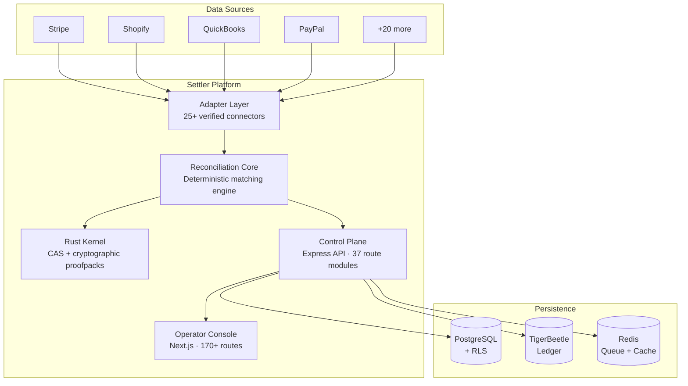

<p align="center">
  
</p>

<h1 align="center">Settler</h1>

<p align="center">
  <strong>Reconciliation intelligence & audit operating system</strong><br />
  Deterministic transaction matching · Hash-linked evidence · Enterprise-grade tenant isolation
</p>

<p align="center">
  <a href="https://github.com/Hardonian/Settler/actions/workflows/ci.yml"></a>
  <a href="LICENSE"></a>
  
  
  
  
</p>

---

## What Settler Does

Settler replaces spreadsheet reconciliation and custom scripts with a deterministic, API-first matching engine. It ingests financial records from multiple sources, matches them using configurable tolerance rules, flags exceptions into structured adjudication workflows, and exports hash-linked evidence bundles — all tenant-isolated and replayable from scratch.

**Every reconciliation run produces byte-for-byte reproducible results.** No probabilistic guessing. No silent degradation. Auditors get verifiable proofpacks, not screenshots.

## Architecture



## Adapter Ecosystem — 25+ Verified Connectors

| Category | Adapters |
|----------|----------|
| **Payment Processors** | Stripe, PayPal, Square, Stripe Connect, Google Pay |
| **Accounting** | QuickBooks, Xero, FreshBooks, Wave, NetSuite |
| **E-Commerce** | Shopify, WooCommerce, Etsy, Amazon Seller, eBay, Wix Stores, TikTok Shop |
| **Banking & Open Finance** | Plaid, TrueLayer |
| **Enterprise ERP** | SAP, NetSuite (advanced) |
| **Subscription Billing** | Chargebee, Recurly |
| **Tax & Compliance** | TaxJar, Avalara |
| **Analytics** | GA4 Deep Sync |
| **Messaging** | WhatsApp, Telegram (notification adapters) |
| **Social Commerce** | Meta Commerce |

Every adapter includes rate limiting, token refresh, webhook verification, and retry queue integration.

## Tech Stack

| Layer | Technology | Purpose |
|-------|-----------|---------|
| **Rust Kernel** | Cargo workspace | Content-addressable storage, cryptographic proofpacks, deterministic primitives |
| **Reconciliation Core** | TypeScript | Matching engine, tolerance evaluation, evidence emission, exception intelligence |
| **Control Plane** | Express 5 + PostgreSQL + Prisma | 37 API route modules, multi-tenant middleware, event sourcing, billing enforcement |
| **Operator Console** | Next.js 16 (App Router) | 170+ routes — run history, exception review, evidence export, admin surfaces |
| **CLI** | TypeScript via tsx | Foundry (test data), replay, prove, first-run validation |
| **Queue** | BullMQ / Redis | Job orchestration with retry, SLA alerting, exponential backoff |
| **Ledger** | TigerBeetle | Immutable double-entry financial records (optional) |

## Enterprise Features

- **Multi-Tenant Isolation** — 5-layer enforcement: middleware → TypeScript interfaces → SQL guards → PostgreSQL RLS → entity-level checks
- **SSO / SAML** — SAML 2.0 via `@node-saml/passport-saml` with configurable IdP
- **DLP (Data Loss Prevention)** — PII redaction middleware for SSN, credit card, and sensitive field patterns
- **SOX-Compliant Approvals** — Maker-checker workflows with audit trail and evidence bundles
- **OpenFGA Authorization** — Attribute-based access control with fail-closed posture
- **SLA Monitoring & Alerting** — Configurable SLA/SLO thresholds with alerting pipelines
- **Billing Gating** — Tier-based feature access with circuit-breaker degraded states
- **46 Middleware Layers** — Auth, CSRF, rate limiting, idempotency, compression, ETag, request signing, observability, and more

## Quick Start

```bash
git clone https://github.com/Hardonian/Settler.git
cd Settler
pnpm run bootstrap     # Creates .env.local, installs deps, validates setup
pnpm tb:start          # Starts PostgreSQL + Redis + TigerBeetle (Docker)
pnpm dev               # http://localhost:3000 (console), http://localhost:4000 (API)
```

**Prerequisites:** Node.js 22+, pnpm 9+, Docker

## Repository Structure

```
packages/
  api/                   Express API — 37 route modules, 46 middleware layers, 80+ services
  web/                   Next.js operator console — 170+ routes
  cli/                   CLI tooling (foundry, replay, verification)
  reconciliation-core/   Core matching engine and run result serialization
  adapters/              25+ source/target connectors with rate limiting & retry
  types/                 Shared TypeScript types
  sdk/                   Client SDK
  proofs/                Proofpack generation utilities
  edge-ai-core/          ML matching enhancement (optional)
  react-settler/         React component library
  compliance/            Compliance evidence generation
  logger/                Structured logging
crates/
  settler-kernel/        Rust — CAS, cryptographic hashing, deterministic primitives
  settler-verify-wasm/   WASM build for browser-side proof verification
scripts/                 Build, CI, and operational automation
prisma/                  Schema and migrations
```

## Verification

The monorepo includes a multi-tier verification pipeline:

```bash
pnpm verify        # Full: lint → typecheck → build → test → integrity checks
pnpm verify:fast   # Fast: lint → typecheck → env contract → dist freshness
pnpm test          # Unit tests across all packages
pnpm test:e2e      # Playwright-based end-to-end tests
```

## API

Versioned routes under `/api/v1/`. Key endpoints:

| Endpoint | Method | Description |
|----------|--------|-------------|
| `/api/v1/ingestion` | POST | Ingest source/target records (CSV, JSON, webhooks) |
| `/api/v1/reconciliation/run` | POST | Execute a reconciliation run |
| `/api/v1/reconciliation/runs` | GET | List reconciliation runs |
| `/api/v1/reconciliation/runs/:id` | GET | Run detail with evidence |
| `/api/v1/audit-trail` | GET | Append-only audit log |
| `/api/v1/approvals` | POST/GET | SOX maker-checker workflows |
| `/api/v1/sla` | GET | SLA monitoring dashboard data |
| `/api/v1/billing/status` | GET | Subscription and usage status |

Full API reference: [docs/API_REFERENCE.md](docs/API_REFERENCE.md)

## Documentation

| Document | Description |
|----------|-------------|
| [SETUP.md](SETUP.md) | Canonical local development setup |
| [PRODUCT_OVERVIEW.md](PRODUCT_OVERVIEW.md) | Platform architecture and design |
| [SECURITY_INVARIANTS.md](SECURITY_INVARIANTS.md) | Tenant isolation and security model |
| [CONTRIBUTING.md](CONTRIBUTING.md) | Contribution guidelines |
| [CHANGELOG.md](CHANGELOG.md) | Release history |

## Contributing

See [CONTRIBUTING.md](CONTRIBUTING.md). All pull requests must pass `pnpm verify` and `pnpm run typecheck`.

## License

See [LICENSE](LICENSE).
