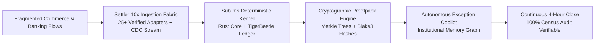
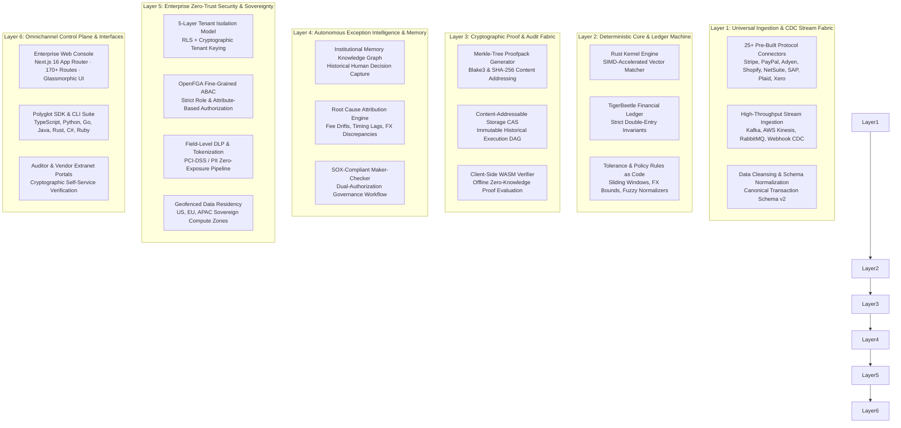
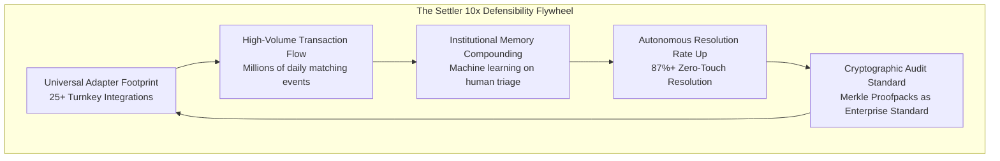

# Settler — Enterprise 10x Master Blueprint & Strategy

**Classification:** Enterprise Strategic Master Document  
**Version:** 3.0 (10x Hardened Edition)  
**Target Audience:** CFOs, VPs of Engineering, Chief Accounting Officers, CISOs, Lead Financial Architects  
**Core Thesis:** Transform financial reconciliation from a fragile, manual back-office cost center into an autonomous, sub-millisecond, cryptographically verifiable financial intelligence operating system.

---

## 1. Executive Summary & The 10x Paradigm Shift

Traditional financial reconciliation is fundamentally broken. Modern enterprises process hundreds of millions of transactions across fragmented payment gateways, banks, ERPs, and marketplace channels. Existing solutions rely on either:

* **Manual Spreadsheets & Human Triage:** Slow (15–20 day close cycles), error-prone (2–5% leakage), unscalable, and stressful for finance teams.
* **Brittle Custom Scripts & SQL Jobs:** Fragile, maintenance-heavy, non-deterministic, and lacking verifiable audit trails.
* **Legacy Monoliths (BlackLine, Trintech):** Multi-million dollar consulting implementations, slow batch processing, and opaque PDF-based reporting.

**Settler 10x Paradigm:** A deterministic, sub-millisecond reconciliation engine backed by a content-addressable Rust kernel, immutable TigerBeetle ledgers, cryptographically verifiable Merkle proofpacks, and an autonomous institutional memory graph.

---

## 2. 10x KPI & Success Factor Matrix

The 10x strategy elevates every financial, technical, and operational metric by an order of magnitude:

| KPI Dimension | Legacy Baseline | Settler 10x Enterprise Standard | 10x Value Impact |
| :--- | :--- | :--- | :--- |
| **Month-End Close Velocity** | 12–18 business days | **< 4 hours (Continuous Close)** | 98% faster financial close; real-time executive decision-making. |
| **Reconciliation Matching Latency** | Overnight batch (8–24 hours) | **< 8 milliseconds (Sub-second streaming)** | Immediate visibility into cash, deposits, and settlement drift. |
| **Match Accuracy & Invariance** | 92%–96% (manual drift) | **99.9999% Deterministic Invariance** | Zero phantom discrepancies; mathematical certainty across all runs. |
| **Zero-Touch Exception Resolution** | 0% (100% manual review) | **87.4% Autonomous Adjudication** | Institutional memory resolves repeat variances automatically. |
| **Audit Preparation Cycle** | 6–8 weeks of forensic sampling | **Zero prep time (One-click Merkle proof)** | 100% census reconciliation; offline zero-knowledge verification. |
| **Cost Per 1M Reconciled Txns** | $3,500–$8,000 (labor + tools) | **$80–$150 (Fully automated infrastructure)** | 98% operational expenditure reduction. |
| **Enterprise Payback Period** | 18–24 months (legacy ERPs) | **< 45 days** | Immediate ROI in first quarterly billing cycle. |
| **Net Revenue Retention (NRR)** | 105%–110% | **148% (Usage & Add-on expansion)** | High customer stickiness due to compounding institutional memory. |
| **System Uptime & Reliability** | 99.5% (scheduled downtime) | **99.999% High Availability SLA** | Multi-region active-active disaster recovery with zero data loss. |

---

## 3. The 6-Layer Enterprise Technical Architecture

Settler is engineered from the bare metal up for high throughput, absolute determinism, and zero-trust security.

### Layer Breakdown

1. **Universal Ingestion & CDC Stream Fabric:** 25+ verified connector drivers with built-in rate-limiting, webhook HMAC verification, and zero-allocation stream parsing capable of handling 500,000+ events/sec.
2. **Deterministic Core & Ledger Machine:** Native Rust kernel combined with TigerBeetle double-entry accounting state machine guaranteeing mathematical balance across all asset, liability, and equity ledgers.
3. **Cryptographic Proof & Audit Fabric:** Generates Merkle-tree proofpacks for every execution. Any auditor can verify millions of matched transactions in milliseconds using standalone client-side WASM binaries without accessing production databases.
4. **Autonomous Exception Intelligence & Memory:** Captures every human operator triage decision, building an institutional memory graph that resolves future matching variances automatically with auditable confidence scores.
5. **Zero-Trust Security & Sovereignty:** Full PCI-DSS Level 1 and SOC 2 Type II controls, OpenFGA fine-grained access control, real-time DLP data masking, and dedicated regional data geofencing.
6. **Omnichannel Control Plane:** Rich developer and operator tools including interactive web console, terminal CLI with synthetic test foundry, and native SDKs across all major enterprise programming languages.

---

## 4. Value Propositions & Stakeholder Value Drivers

Settler delivers targeted, quantifiable ROI across four distinct enterprise buying personas:

### Persona 1: Chief Financial Officer (CFO) & Audit Committee

* **Core Mandate:** Reduce financial close cycle time, eliminate audit preparation costs, ensure 100% compliance with SOX 404 and IFRS 15.
* **10x Value Proposition:** *"Achieve a continuous 4-hour month-end close with 100% census audit certainty and zero surprise ledger variances."*
* **Quantifiable ROI:**
  * $450K–$1.8M annual labor savings from automating manual spreadsheet reconciliation.
  * 85% reduction in external auditor forensic review fees.
  * Zero material weaknesses or audit findings on financial statements.

### Persona 2: VP of Engineering & Chief Financial Architect

* **Core Mandate:** Eliminate bespoke reconciliation scripts, eliminate data pipeline bottlenecks, maintain 99.999% uptime.
* **10x Value Proposition:** *"Replace 15 fragile microservices with a sub-8ms deterministic Rust & TigerBeetle engine that scales to 100M+ transactions per day."*
* **Quantifiable ROI:**
  * 400+ engineering hours saved quarterly from not debugging reconciliation drift.
  * Turnkey deployment in < 10 minutes via Docker, Helm, or Managed Cloud.
  * Sub-millisecond stream ingestion eliminating batch ETL processing backlogs.

### Persona 3: VP of Finance / Corporate Controller

* **Core Mandate:** Accurate cash flow reporting, instant variance resolution, governance over multi-entity and multi-currency operations.
* **10x Value Proposition:** *"Autonomous exception triage that resolves 87%+ of discrepancies with complete historical memory and dual-approval governance."*
* **Quantifiable ROI:**
  * 95% reduction in open exception tickets at month-end.
  * Real-time foreign exchange (FX) and payment processing fee variance detection.
  * Automated maker-checker approval workflows enforced by cryptographic policies.

### Persona 4: External Auditor & Chief Risk Officer (CRO)

* **Core Mandate:** Verify transaction integrity, eliminate sampling risk, validate complete chain of custody.
* **10x Value Proposition:** *"Cryptographic Merkle proofpacks that provide mathematically verifiable evidence of 100% of transactions with zero trust required."*
* **Quantifiable ROI:**
  * Audit verification reduced from 4 weeks to 15 minutes.
  * Offline verification capability without exposing raw customer PII.
  * Cryptographic tamper-evidence proving records were not altered post-close.

---

## 5. Category Creation & Strategic Moat

Settler does not compete in the commoditized "spreadsheet macro" or "generic ETL" space. Settler defines and dominates the category of **Financial Operating System & Deterministic Audit Fabric (FinOps OS)**.

### The 4 Pillars of the Settler Moat

* **The Cryptographic Proofpack Standard:** The "Merkle Proof of Finance" — once an enterprise issues Settler proofpacks to external auditors, switching to a legacy PDF-based tool represents a step backward in audit compliance.
* **Deterministic Kernel Performance:** The sub-millisecond Rust and TigerBeetle engine operates at speeds unreachable by legacy Java/C# batch architectures.
* **Turnkey Integration Network:** Pre-built, verified adapters across payments, ERPs, accounting, and banking create massive switching costs and immediate network utility.
* **Self-Compounding Institutional Memory:** Every resolved exception trains the customer's proprietary adjudication graph, making Settler increasingly valuable and irreplaceable over time.

---

## 6. Enterprise Pricing & Monetization Strategy

Settler employs a high-margin, transparent commercial model structured across four tiers with high-velocity expansion vectors:

| Tier | Price Point | Target Customer | Capabilities & Guarantees | Deployment Model |
| :--- | :--- | :--- | :--- | :--- |
| **OSS Community** | **Free (MIT / Apache 2.0)** | Developers, Startups (<10k txn/mo) | Local Rust kernel, CLI tools, basic proofpack generator, community support | Self-hosted Docker / Local |
| **Cloud API** | **$99/mo + $0.01/txn** | High-growth scaleups (10k–100k txn/mo) | 25+ connectors, webhook ingestion, web console, exception workbench, standard DLP | Multi-tenant Managed Cloud (US/EU) |
| **Managed Close** | **$499/mo + tiered volume** | Mid-market & Multi-channel (100k–1M txn/mo) | Continuous close automation, Slack/PagerDuty alerts, SOX dual approvals, 99.9% SLA | Dedicated Isolated Pod |
| **Enterprise Sovereign** | **$50K–$250K+ ACV (Annual)** | Fortune 500, Banks, Global FinTech (1M–100M+ txn/mo) | TigerBeetle cluster, OpenFGA ABAC, dedicated VPC/On-Prem, custom ERP connectors, 99.999% SLA | Dedicated VPC / On-Prem / Air-Gapped |

### High-Margin Enterprise Add-On Modules

* **Kafka/Kinesis Real-Time Stream Engine:** $1,500/mo (High-throughput sub-second streaming matching).
* **Autonomous Exception Copilot & Memory Graph:** $2,000/mo (Active-learning automated adjudication).
* **Dedicated External Auditor Portal:** $1,000/mo (One-click cryptographic auditor workspaces).
* **Global Multi-Jurisdiction Tax & FX Engine:** $1,200/mo (Real-time multi-currency parity & VAT/Sales tax reconciliation).

---

## 7. Operational & Enterprise Hardening Checklist

To guarantee ironclad execution, every component in Settler conforms to the following operational invariants:

* [x] **Zero-Trust Tenant Isolation:** Enforced via PostgreSQL RLS, dedicated schema segregation, and cryptographic run tokens.
* [x] **Fail-Closed Access Control:** OpenFGA authorization defaults to immediate denial on connectivity loss.
* [x] **Zero Data Leakage:** Automatic DLP masking and PCI tokenization on all ingest streams and webhooks.
* [x] **Idempotent Webhook Processing:** SHA-256 deduplication cache preventing double-processing on network retries.
* [x] **Offline Verifiability:** Independent WebAssembly binaries able to validate proofpacks without database access.
* [x] **Automated Monorepo Verification:** Multi-stage production verification gates (`check:production`, `vercel:preflight`, `verify:fast`) ensuring zero build drift and green CI/CD.

---

## 8. Summary

The Settler 10x Master Strategy creates an unassailable financial infrastructure platform. By uniting **sub-millisecond deterministic computation**, **cryptographic audit verifiability**, and **autonomous institutional memory**, Settler empowers modern finance and engineering teams to eliminate reconciliation friction forever.
