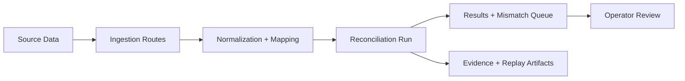

# Data Flow

```mermaid
flowchart LR
  A[Source Data] --> B[Ingestion Routes]
  B --> C[Normalization + Mapping]
  C --> D[Reconciliation Run]
  D --> E[Results + Mismatch Queue]
  E --> F[Operator Review]
  D --> G[Evidence + Replay Artifacts]
```
