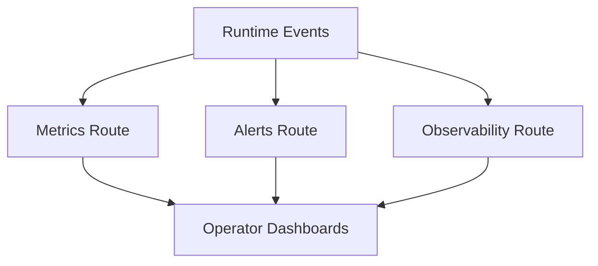

# Event Telemetry Pipeline

```mermaid
flowchart TD
  A[Runtime Events] --> B[Metrics Route]
  A --> C[Alerts Route]
  A --> D[Observability Route]
  B --> E[Operator Dashboards]
  C --> E
  D --> E
```
