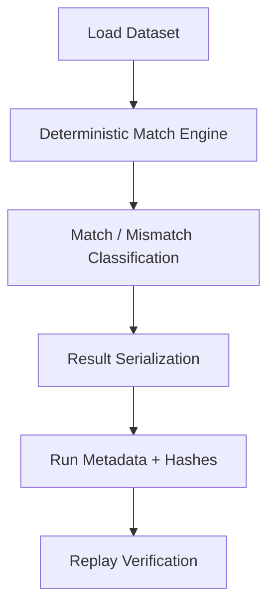

# Reconciliation Pipeline

```mermaid
flowchart TD
  A[Load Dataset] --> B[Deterministic Match Engine]
  B --> C[Match / Mismatch Classification]
  C --> D[Result Serialization]
  D --> E[Run Metadata + Hashes]
  E --> F[Replay Verification]
```
