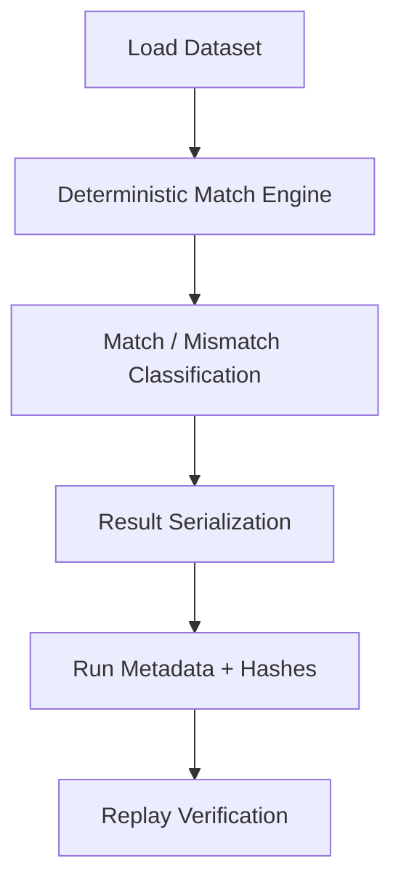

# Reconciliation Pipeline

The reconciliation pipeline turns canonical inputs into deterministic, replayable outputs with operator-visible evidence.

## Pipeline stages

## Stage semantics

1. **Load dataset**: normalize connector payloads into canonical records.
2. **Deterministic match engine**: apply rules in stable order with explicit tie-breaking.
3. **Classification**: emit matched, mismatched, and needs-review outcomes.
4. **Serialization**: write stable result artifacts (`run.json`, `results.json`, `evidence.json`).
5. **Run metadata + hashes**: persist run identifiers, checksums, and provenance markers.
6. **Replay verification**: re-run identical input/rule sets and compare hash/result equivalence.

## Failure behavior

- Input/schema violations fail fast with structured diagnostics.
- Replay mismatches are surfaced as explicit divergence events (never silent success).
- Tenant scope violations hard-fail before data access.

## Related docs

- [System architecture](./system-architecture.md)
- [Execution lifecycle](./execution-lifecycle.md)
- [Failure intelligence](./failure-intelligence.md)
