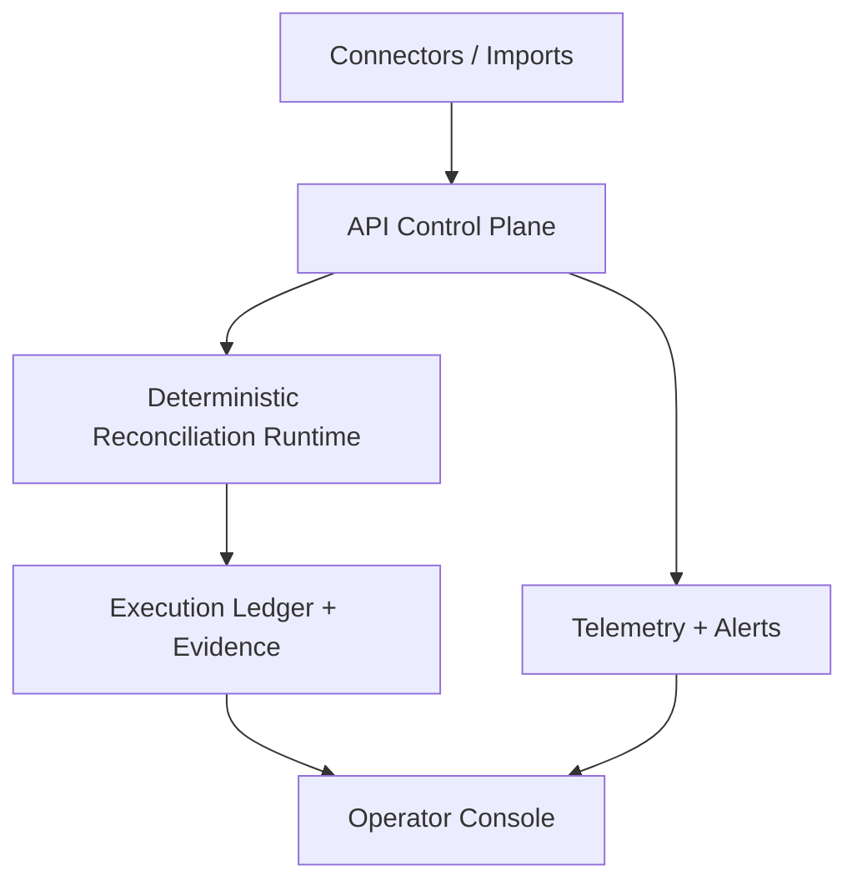

# System Architecture

```mermaid
graph TD
  A[Connectors / Imports] --> B[API Control Plane]
  B --> C[Deterministic Reconciliation Runtime]
  C --> D[Execution Ledger + Evidence]
  D --> E[Operator Console]
  B --> F[Telemetry + Alerts]
  F --> E
```
