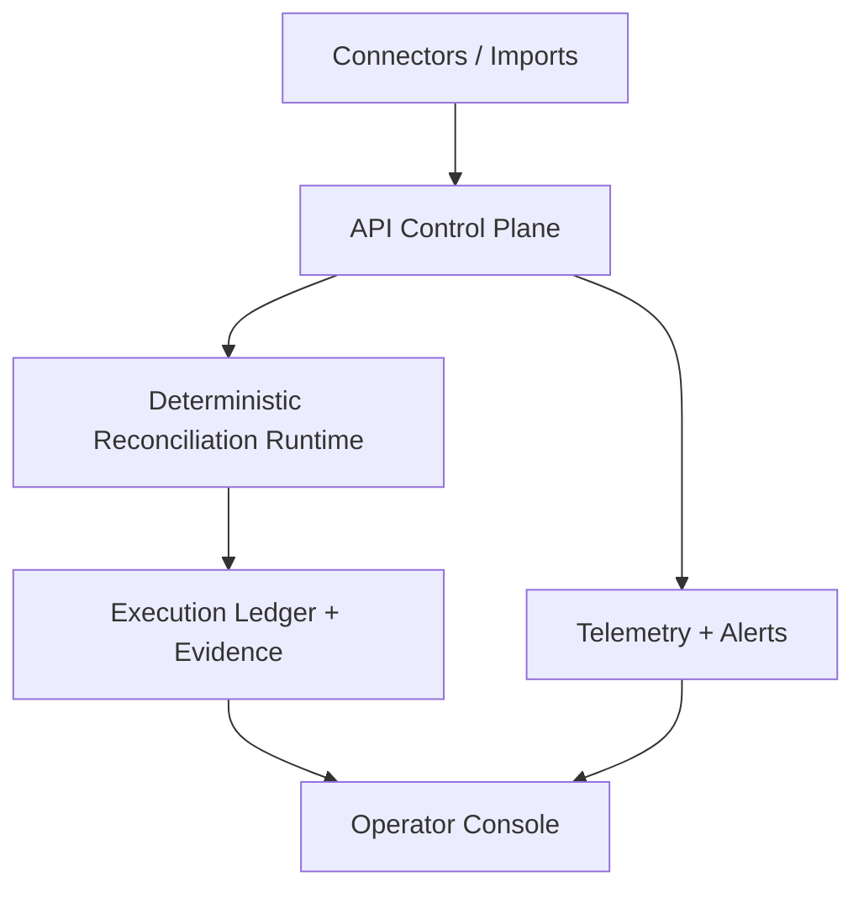

# System Architecture

Settler is split into a control plane, deterministic execution runtime, and evidence surfaces.

## Component map

## Runtime boundaries

- **Control plane (`packages/api`)**: request validation, authn/authz, tenant scoping, idempotency, and route orchestration.
- **Execution runtime (`packages/cli` and runtime services)**: deterministic reconciliation runs, replay verification, and failure capture.
- **Evidence + operator surfaces (`packages/web`)**: proof explorer, reconciliation status, and operator diagnostics.

## Trust and isolation invariants

- Every protected request must carry tenant context; cross-tenant reads/writes are rejected.
- Execution artifacts are keyed by run identity and scoped access checks.
- Degraded states (missing dependencies, readiness failures, policy failures) must be explicit and observable.

## Related docs

- [Reconciliation pipeline](./reconciliation-pipeline.md)
- [Execution ledger](./execution-ledger.md)
- [Traceability](./traceability.md)
- [Data model entrypoint](./data-model.md)
