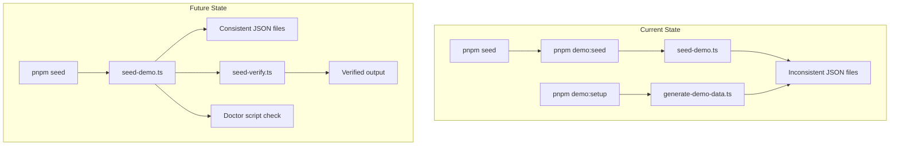

# Plan: Improve Demo Seed Reliability for Settler Repository

## Executive Summary

The test phase revealed multiple seed scripts with potential reliability issues. This plan outlines improvements to ensure operators have a single, trustworthy canonical seed command with verification capabilities.

---

## Current State Analysis

### Seed Scripts Found

| Script | Purpose | Output |
|--------|---------|--------|
| `scripts/seed-demo.ts` | Generates demo JSON files | `demo/data/demo_stripe_transactions.json`, `demo_bank_transactions.json`, `demo_expected_matches.json` |
| `scripts/generate-demo-data.ts` | Generates demo JSON files | `demo/data/stripe_normalized.json`, `bank_normalized.json`, `expected_matches.json` |
| `scripts/seed-reconciliation-fixtures.ts` | Seeds database with test data | Database records (transactions, reconciliation runs) |
| `scripts/seed-tenant.ts` | Seeds default tenant | Database tenant record |
| `scripts/post-migration-seed.ts` | Seeds add-ons after migrations | Supabase add_ons table |

### Package.json Seed Commands

```json
"demo:seed": "npx tsx scripts/seed-demo.ts"
"demo:seed:reset": "npx tsx scripts/seed-demo.ts --reset"
"demo:setup": "tsx scripts/generate-demo-data.ts"
"demo:reset": "tsx scripts/generate-demo-data.ts"
"seed": "pnpm run demo:seed"
```

### Issues Identified

1. **Conflicting file outputs** - Two scripts generate different JSON files to the same directory
2. **No canonical command** - Multiple commands with overlapping functionality
3. **No verification** - No way to verify seed data was loaded successfully
4. **Silent failures** - Playground auto-generation spawns a process that could fail silently
5. **Doctor script gaps** - Only checks for tenants, not demo data files

---

## Proposed Implementation Plan

### Phase 1: Consolidate Seed Commands

**1.1 Standardize on `seed-demo.ts` as the canonical script**
- Keep `scripts/seed-demo.ts` as the single source of truth
- Deprecate `scripts/generate-demo-data.ts` or make it an alias
- Update `package.json` to have clear, non-overlapping commands:
  ```json
  "seed": "tsx scripts/seed-demo.ts",
  "seed:verify": "tsx scripts/seed-verify.ts",
  "seed:reset": "tsx scripts/seed-demo.ts --reset"
  ```

**1.2 Fix file output consistency**
- Ensure `seed-demo.ts` outputs the correct file names that the playground expects
- Current playground expects: `demo_stripe_transactions.json`, `demo_bank_transactions.json`, `demo_expected_matches.json`

### Phase 2: Add Seed Verification

**2.1 Create `scripts/seed-verify.ts`**
- Verify demo data files exist and are valid JSON
- Check minimum record counts
- Provide clear success/failure output
- Exit with appropriate codes (0 = success, 1 = failure)

**2.2 Add `--verify` flag to `seed-demo.ts`**
- After seeding, optionally verify the output

### Phase 3: Improve Error Handling

**3.1 Improve `ensureDemoData()` in playground.ts**
- Add timeout handling for auto-generation
- Add retry logic
- Log errors more clearly
- Return more actionable error messages

**3.2 Add logging to seed scripts**
- More detailed console output
- Error context for debugging

### Phase 4: Update Doctor Script

**4.1 Enhance `checkSeedData()` in `scripts/doctor.ts`**
- Check for demo data files (not just database tenants)
- Provide actionable remediation steps

**4.2 Add demo data check**
- Verify demo JSON files exist and are valid
- Check file sizes to detect incomplete generation

---

## Implementation Steps

1. [ ] Create `scripts/seed-verify.ts` for verification
2. [ ] Update `scripts/seed-demo.ts` to output consistent file names
3. [ ] Update `package.json` seed commands for clarity
4. [ ] Improve error handling in `packages/api/src/routes/playground.ts`
5. [ ] Update `scripts/doctor.ts` to check demo data files

---

## Mermaid: Current vs. Future State



---

## Acceptance Criteria

1. ✅ Single canonical seed command: `pnpm seed`
2. ✅ Verification command: `pnpm seed:verify`
3. ✅ Doctor script reports demo data status
4. ✅ Playground auto-generation is more robust with better error messages
5. ✅ Clear documentation for operators
