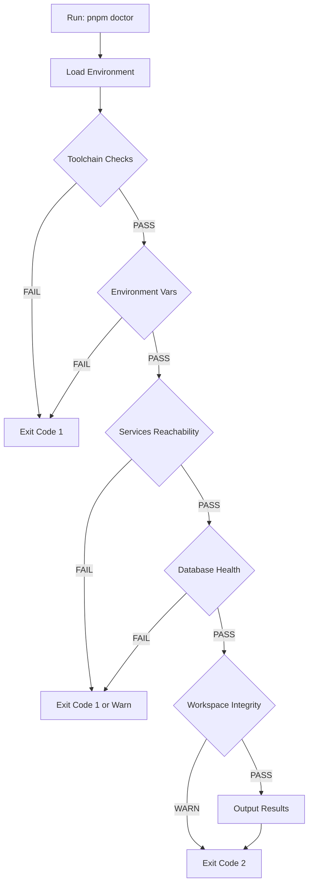

# Settler Doctor - Phase 2 Implementation Plan

## Executive Summary

Create a comprehensive self-check mechanism (`scripts/doctor.ts`) that helps operators verify their local development environment before running the application. This builds upon existing scripts but adds critical checks that are currently missing.

## Services & Ports Reference

```
PostgreSQL:  localhost:5432 (DB_HOST, DB_PORT)
Redis:       localhost:6379 (REDIS_HOST, REDIS_PORT)  
TigerBeetle: localhost:4300 (TIGERBEETLE_ADDRESS)
Web:         localhost:3000 (default)
API:         localhost:4000 (default)
```

## Implementation Checklist

### 1. Core Toolchain Checks
- [ ] Node.js version >= 24.x (check .nvmrc)
- [ ] pnpm version >= 10.13
- [ ] Docker/Docker Compose availability
- [ ] Git availability

### 2. Environment Variables
- [ ] Required vars: NEXT_PUBLIC_SUPABASE_URL, NEXT_PUBLIC_SUPABASE_ANON_KEY
- [ ] Database URL: DATABASE_URL or DB_HOST/DB_PORT combination
- [ ] Production secrets (when NODE_ENV=production)

### 3. Docker Services Connectivity
- [ ] PostgreSQL: port 5432 reachable
- [ ] Redis: port 6379 reachable
- [ ] TigerBeetle: port 4300 reachable
- [ ] Docker daemon running

### 4. Database Health
- [ ] Prisma client generated
- [ ] Database schema up-to-date (migration status)
- [ ] Database connectivity verified
- [ ] Seed data present (optional for dev)

### 5. Workspace Integrity
- [ ] node_modules installed
- [ ] pnpm-lock.yaml present
- [ ] Critical workspace files exist

### 6. Build Prerequisites
- [ ] TypeScript compiles without errors
- [ ] Lint passes

## Output Format

### Human-Readable
```
🏥 Settler Doctor - Local Environment Health Check
==================================================

[TOOLCHAIN]
✅ PASS: Node.js v24.12.0 (required: >=24.x)
✅ PASS: pnpm 10.13.0 (required: >=10.13)
✅ PASS: Docker is available

[ENVIRONMENT]
✅ PASS: Required environment variables present
⚠️  WARN: Optional variables missing: STRIPE_SECRET_KEY (billing disabled)

[SERVICES]
✅ PASS: PostgreSQL on port 5432 is reachable
✅ PASS: Redis on port 6379 is reachable
✅ PASS: TigerBeetle on port 4300 is reachable

[DATABASE]
✅ PASS: Database connection successful
✅ PASS: Prisma client generated
✅ PASS: Migrations up-to-date (15 migrations applied)

[WORKSPACE]
✅ PASS: Dependencies installed
⚠️  WARN: Uncommitted changes detected

==================================================
📊 Summary: 10 passed, 2 warnings, 0 failures
⚠️  Warnings found - review before proceeding
```

### Machine-Readable (JSON)
```json
{
  "status": "warning",
  "timestamp": "2026-03-18T20:00:00.000Z",
  "summary": {
    "passed": 10,
    "warnings": 2,
    "failures": 0,
    "total": 12
  },
  "checks": [
    {
      "category": "toolchain",
      "name": "Node.js",
      "status": "pass",
      "message": "v24.12.0 (required: >=24.x)",
      "remediation": null
    }
  ]
}
```

## Exit Codes
- `0`: All checks passed
- `1`: One or more failures (blocking issues)
- `2`: Warnings only (non-blocking)

## Remediation Guidance Examples

| Check | Failure | Remediation |
|-------|---------|-------------|
| Node.js | Version mismatch | Run `nvm use 24.12.0` or `nvm install` |
| Docker | Not running | Start Docker Desktop or run `dockerd` |
| PostgreSQL | Port unreachable | Run `pnpm tb:start` to start services |
| Prisma | Not generated | Run `pnpm prisma:generate` |
| Migrations | Pending | Run `pnpm db:migrate` |
| node_modules | Missing | Run `pnpm install` |

## File Location
- Script: `scripts/doctor.ts`
- Entry point in package.json: Already configured as `doctor` -> `node scripts/doctor.mjs`
- Note: Will replace the existing doctor implementation at `scripts/doctor.ts`

## Mermaid: Doctor Flow


