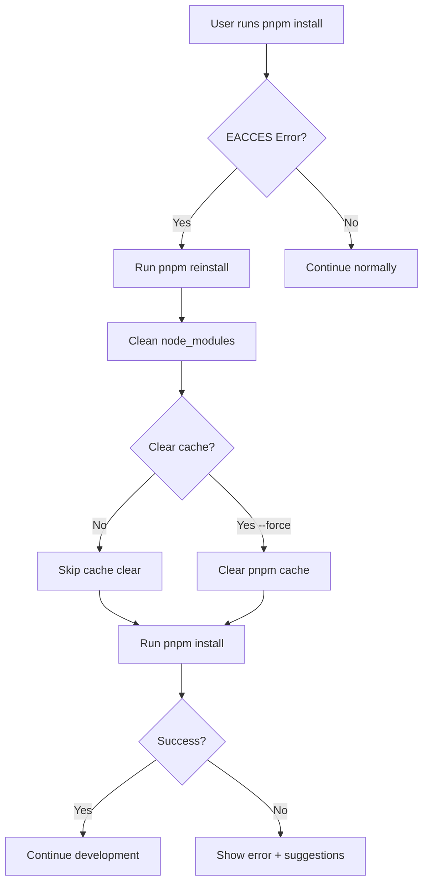

# Plan: Fix EACCES/Install Issues for Settler Repository

## Problem Summary

The test phase revealed that `pnpm install` fails with EACCES permission errors on existing files, preventing build, typecheck, lint, and tests from running.

## Root Cause Analysis

EACCES permission errors during `pnpm install` typically occur when:

1. **Ownership Issues**: Files in `node_modules` were created by a different user (common when switching between users, running in containers, or cloning repos)
2. **PNPM Store Permissions**: The pnpm store directory (`~/.pnpm-store`) has permission issues
3. **Stale File Handles**: Previous interrupted installs left corrupted state
4. **Windows-specific**: Symlink permission issues (EPERM) can manifest as EACCES-like errors

## Current State

The repository already has some cleanup scripts:

- `scripts/clean.mjs` - Cleans build artifacts, with `--deps` and `--all` flags
- `package.json` scripts: `clean`, `clean:deps`, `clean:all`, `build:clean`
- `pnpm:ci:install` - Uses corepack + frozen-lockfile
- `bootstrap` - Creates env + installs + validates

**What's Missing:**

- No dedicated script that handles EACCES-specific permission fixes
- No clear documentation about EACCES troubleshooting
- No "safe reinstall" command for operators

## Proposed Solution

### 1. Create a Clean-Install Script (`scripts/clean-install.mjs`)

A dedicated script that:
- Detects the platform (Windows/macOS/Linux)
- Safely removes `node_modules` directories
- Clears pnpm cache if needed (with user confirmation)
- Reinstalls dependencies with proper flags
- Provides clear output about what was done

### 2. Add Package.json Scripts

Add to `package.json`:

```json
{
  "reinstall": "node scripts/clean-install.mjs",
  "reinstall:force": "node scripts/clean-install.mjs --force"
}
```

### 3. Update Documentation

Add EACCES troubleshooting section to:

- `docs/troubleshooting/installation-and-setup.md` - Add EACCES section
- `SETUP.md` - Add reference to reinstall command
- Optionally add to `WINDOWS_DEVELOPMENT.md` if Windows-specific

## Implementation Plan

### Step 1: Create `scripts/clean-install.mjs`

- Platform detection (Windows/macOS/Linux)
- Remove all `node_modules` directories safely
- Optional: Clear pnpm store cache (with `--force` flag)
- Run `pnpm install` with appropriate flags
- Report success/failure with helpful messages

### Step 2: Add npm Scripts to `package.json`

- `reinstall` - Safe reinstall (asks before clearing cache)
- `reinstall:force` - Force clear cache and reinstall

### Step 3: Update Documentation

- Add EACCES troubleshooting to `docs/troubleshooting/installation-and-setup.md`
- Reference the new `reinstall` command in `SETUP.md`

### Step 4: Verify

- Test the script works on the current system
- Ensure no regression in existing scripts

## Files to Modify

| File | Action |
|------|--------|
| `scripts/clean-install.mjs` | Create new file |
| `package.json` | Add `reinstall` and `reinstall:force` scripts |
| `docs/troubleshooting/installation-and-setup.md` | Add EACCES section |
| `SETUP.md` | Reference reinstall command |

## Mermaid Workflow


