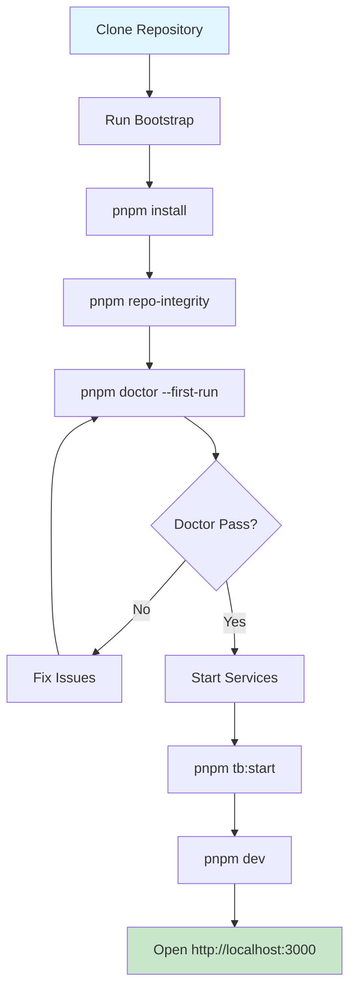

# Phase 1: Canonical Local Setup Path - Implementation Plan

## Executive Summary

The Settler repository already has robust setup infrastructure in place. The goal of Phase 1 is to **consolidate and normalize** the existing setup paths rather than creating new ones. The key deliverables are:

1. **Version consistency** - Align Node.js version specs across all files
2. **Service documentation** - Clearly list all required services
3. **Truthful env configuration** - Ensure .env.local.example is accurate
4. **Minimal time-to-first-working-screen** - Optimize the quickstart path

---

## Current State Assessment

### Existing Infrastructure ✅
| Component | Location | Status |
|-----------|----------|--------|
| Canonical setup doc | `SETUP.md` | ✅ Created |
| Bootstrap script | `scripts/bootstrap.mjs` | ✅ Comprehensive |
| Doctor script | `scripts/doctor.mjs` | ✅ Robust validation |
| Verify setup | `scripts/verify-setup.ts` | ✅ Available |
| Env templates | `.env.local.example` | ✅ Working defaults |

### Version Specifications (INCONSISTENT) ⚠️
| File | Value |
|------|-------|
| `.node-version` | `24.12.0` |
| `.nvmrc` | `24.12.0` |
| `package.json engines` | `>=22.0.0 <25.0.0` |
| `SETUP.md` | "Version 22.0 or higher" |

---

## Implementation Plan

### 1. Version Consistency (Priority: HIGH)

**Current Issue**: `.node-version` and `.nvmrc` specify exact version `24.12.0`, but `package.json` says `>=22.0.0`. This creates confusion about the actual minimum version.

**Action Items**:
- [ ] Update `package.json` engines field to match exact version: `"node": ">=24.0.0 <25.0.0"`
- [ ] Update `SETUP.md` to specify "Node.js 24.x (24.12.0 recommended)"
- [ ] Add comment in `package.json` explaining why 24.x is required (if applicable)
- [ ] Update `.npmrc` to ensure pnpm version is enforced

**Files to Modify**:
- `package.json` (engines field)
- `SETUP.md`

### 2. Required Services Documentation (Priority: HIGH)

**Current State**: Services are defined in docker-compose files but not clearly documented in SETUP.md.

**Action Items**:
- [ ] Add "Required Services" section to `SETUP.md`:
  - **PostgreSQL** (port 5432) - Main database
  - **TigerBeetle** (port 4300) - Financial ledger
  - **Redis** (port 6379) - Caching/queues (optional for basic dev)
- [ ] Document `pnpm tb:start` command and what it starts
- [ ] Document alternative: using Supabase local/Cloud for database

**Files to Modify**:
- `SETUP.md`

### 3. Environment Configuration Truthfulness (Priority: HIGH)

**Current State**: `.env.local.example` exists and provides working defaults. Doctor script validates required vars.

**Action Items**:
- [ ] Audit `.env.local.example` against doctor.mjs required checks:
  - ✅ `NEXT_PUBLIC_SUPABASE_URL`
  - ✅ `NEXT_PUBLIC_SUPABASE_ANON_KEY`
  - ✅ `SUPABASE_URL`
  - ✅ `SUPABASE_ANON_KEY`
  - ✅ `DATABASE_URL` (or alternative)
  - ✅ `JWT_SECRET`
  - ✅ `ENCRYPTION_KEY`
- [ ] Add comments distinguishing **required** vs **optional** vars
- [ ] Ensure safe placeholder values exist for all required vars
- [ ] Document which vars can use dev defaults vs must be real values

**Files to Modify**:
- `.env.local.example`

### 4. Time-to-First-Working-Screen Flow (Priority: MEDIUM)

**Current State**: The path is:
```bash
git clone → pnpm install → pnpm tb:start → pnpm dev
```

**Action Items**:
- [ ] Simplify the minimal path if possible
- [ ] Add "Quick Start (Demo Mode)" section to SETUP.md
- [ ] Document what user sees at each step
- [ ] Add troubleshooting for common first-screen issues

**Files to Modify**:
- `SETUP.md`

### 5. Bootstrap Script Enhancement (Priority: MEDIUM)

**Current State**: Bootstrap already:
1. Copies `.env.local.example` → `.env.local`
2. Runs `pnpm install`
3. Runs `pnpm repo-integrity`
4. Runs `pnpm doctor --first-run`

**Potential Enhancements**:
- [ ] Add optional `pnpm tb:start` step to bootstrap (with flag to skip)
- [ ] Add interactive prompts for required configuration
- [ ] Add "first-run complete" summary with next steps

**Files to Modify**:
- `scripts/bootstrap.mjs`

### 6. Doctor Script Enhancements (Priority: LOW)

**Current State**: Comprehensive validation of:
- Toolchain (Node, pnpm)
- Env presence
- Config shape (URL validation)
- Workspace integrity
- Kernel health
- Pipeline checks

**Potential Enhancements**:
- [ ] Add "quick fix" suggestions with one-click commands
- [ ] Add `--fix` flag to auto-remediate common issues
- [ ] Improve error messages for missing services

**Files to Modify**:
- `scripts/doctor.mjs`

---

## Mermaid: Canonical Setup Flow



---

## Files to Modify Summary

| Priority | File | Change |
|----------|------|--------|
| HIGH | `package.json` | Align engines field to `>=24.0.0 <25.0.0` |
| HIGH | `SETUP.md` | Update version, add services section |
| HIGH | `.env.local.example` | Add required/optional comments |
| MEDIUM | `scripts/bootstrap.mjs` | Optional: add tb:start to bootstrap |
| LOW | `scripts/doctor.mjs` | Optional: add auto-fix suggestions |

---

## Success Criteria

1. ✅ All version specs reference the same Node.js version (24.x)
2. ✅ SETUP.md clearly lists all required services and how to start them
3. ✅ `.env.local.example` has working defaults for all required vars
4. ✅ Time-to-first-working-screen is documented and achievable
5. ✅ Bootstrap + Doctor provide clear feedback loop
6. ✅ No conflicting setup paths - all docs point to SETUP.md

---

## Timeline Estimate

- **Version consistency**: 1 file change
- **Services documentation**: 1 section addition  
- **Env truthfulness**: 1 file update
- **Time-to-screen flow**: 1 section addition

**Total: ~4 file modifications across 3 files**
