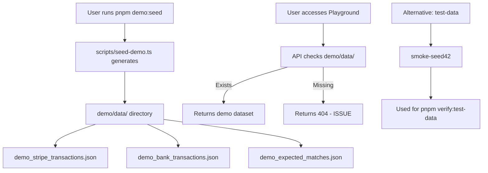

# Phase 6: Demo/Seed Coherence Plan

**Created:** 2026-03-18  
**Purpose:** Ensure demo/seed data is documented, runnable, and routes don't fail silently.

---

## Summary of Current State

### What Exists

1. **Demo Data Generation Scripts:**
   - `scripts/seed-demo.ts` - Generates demo data files (JSON) to `demo/data/`
   - `scripts/generate-demo-data.ts` - Alternative generator creating normalized records
   - Commands: `pnpm demo:seed`, `pnpm demo:setup`, `pnpm demo:seed:reset`

2. **Demo Data Output (`demo/data/`):**
   - `demo_stripe_transactions.json` - Stripe charges and payouts
   - `demo_bank_transactions.json` - Bank deposits and fees
   - `demo_expected_matches.json` - Expected match mappings
   - `stripe_normalized.json`, `bank_normalized.json`, `expected_matches.json` (from generate-demo-data.ts)

3. **Pilot Data (`pilot-data/`):**
   - CSV files: payments.csv, refunds.csv, settlements.csv, discrepancy-scenarios.csv
   - README references non-existent `scripts/pilot/import-workbench.ts`

4. **Test Data (`test-data/exports/smoke-seed42/`):**
   - Pre-generated reconciliation test data with golden results
   - Used for verification: `pnpm verify:test-data`

5. **Demo Walkthrough Documentation:**
   - `docs/getting-started/DEMO_WALKTHROUGH.md` - Step-by-step guide

---

## Issues Identified

### Issue 1: Routes Fail Without Demo Data (Silent Failure Risk)

**Location:** `packages/api/src/routes/playground.ts`

**Problem:** The playground API endpoints check for demo data and return 404 if missing:
- `GET /api/v1/playground/demo-dataset` - Returns 404 if `demo/data/` doesn't exist
- `POST /api/v1/playground/demo-run` - Returns 404 if demo data not present

**Current behavior:**
```typescript
// If demo data missing:
res.status(404).json({ error: "Demo data not generated yet." });
```

**Impact:** Users who start the app without running `pnpm demo:seed` first will see opaque 404 errors.

---

### Issue 2: pilot-data/README References Non-Existent Script

**Location:** `pilot-data/README.md`

**Problem:** Documentation says:
> These files are shaped to feed `scripts/pilot/import-workbench.ts`

But `scripts/pilot/import-workbench.ts` does not exist in the repository.

**Impact:** Users following the pilot-data README will fail to find the referenced script.

---

### Issue 3: Demo Personas/Accounts Not Documented

**Problem:** No clear documentation of:
- What demo accounts exist (if any)
- Whether playground requires authentication
- Default demo credentials

**Current State:** The playground is designed to be **auth-free** (no login required), but this isn't explicitly documented.

---

### Issue 4: SETUP.md Missing Demo Data Verification

**Location:** `SETUP.md`

**Problem:** The canonical setup guide doesn't mention running demo data generation. Users may not know they need `pnpm demo:seed`.

---

## Recommended Fixes

### Fix 1: Create DEMO_SETUP.md

Create `docs/getting-started/DEMO_SETUP.md` documenting:
- All demo data paths
- How to run each generator
- Expected output files
- Verification commands

### Fix 2: Auto-Generate Demo Data in Playground Routes

Modify `packages/api/src/routes/playground.ts` to:
1. Check if demo data exists
2. If missing, automatically call the seed function
3. Return clear error with command to run if auto-generation fails

**Alternative:** Add middleware that runs `pnpm demo:seed` on first request if data missing.

### Fix 3: Fix pilot-data/README

Either:
- Create the missing `scripts/pilot/import-workbench.ts` script, OR
- Update README to remove reference to non-existent script

### Fix 4: Add Demo Data Check to SETUP.md

Add verification step after `pnpm tb:start`:
```bash
# Verify demo data exists (optional but recommended for playground)
ls demo/data/ || pnpm demo:seed
```

### Fix 5: Document Playground Auth-Free Nature

In DEMO_SETUP.md, clearly state:
- Playground requires NO authentication
- Default demo data is used for all operations
- No manual DB edits required

---

## Implementation Tasks

| # | Task | File(s) to Modify | Priority |
|---|------|-------------------|----------|
| 1 | Create DEMO_SETUP.md | New file: `docs/getting-started/DEMO_SETUP.md` | HIGH |
| 2 | Fix playground routes to auto-seed | `packages/api/src/routes/playground.ts` | HIGH |
| 3 | Fix pilot-data/README | `pilot-data/README.md` | MEDIUM |
| 4 | Add demo verification to SETUP.md | `SETUP.md` | MEDIUM |

---

## Demo Data Flow



---

## Verification Commands

After fixes, verify demo coherence:

```bash
# 1. Generate demo data
pnpm demo:seed

# 2. Verify files exist
ls -la demo/data/

# 3. Test playground endpoint
curl http://localhost:4000/api/v1/playground/demo-dataset

# 4. Test demo run
curl -X POST http://localhost:4000/api/v1/playground/demo-run

# 5. Verify pilot data (if script exists)
ls pilot-data/
```
